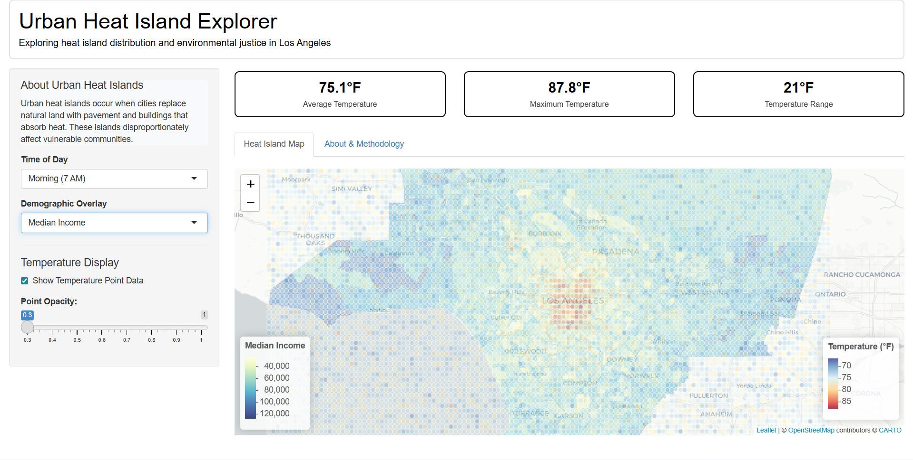

# Urban Heat Island and Environmental Justice Dashboard

**An interactive geospatial analysis tool exploring the relationship between urban heat patterns and vulnerable populations in Los Angeles.**

[🔗 View Live Dashboard](https://YOURUSERNAME.shinyapps.io/heat_island_dashboard/)

---

## Overview

This interactive R Shiny dashboard visualizes urban heat patterns across Los Angeles County and overlays different demographic data variables to allow the user to explore the relationship between heat and environmentall justice concerns.

Heat islands often disproportionately affect low-income communities, communities of color, and other vulnerable or underserved populations.

### User Selection Options

- Available county-level demographic variables include median income, percent people of color, percent over 65, and percent in poverty.
- Available temperature data for different time points during the day including morning, afternoon, and evening
- User may change the opacity of the temperature data overlay or deactivate the overlay.

---

## Technical Implementation

### Built With

- **R Shiny** - Interactive web application framework
- **Leaflet** - Interactive mapping and geospatial visualization
- **sf** - Spatial data handling and analysis
- **tigris** - Census boundary data
- **dplyr** - Data manipulation and transformation

### Data Sources

**Spatial Boundaries:**
- Real census tract boundaries from U.S. Census Bureau (via tigris package)
- Los Angeles County, California (2020 boundaries)

**Temperature Data:**
- Simulated based on documented urban heat island patterns

**Demographic Data:**
- Census tract-level socioeconomic indicators

---

## About

**Kate Vavra-Musser**  
PhD, Population, Health, and Place  
Postdoctoral Researcher in Geospatial Data Science

**Contact:**  
- Email: vavramusser@gmail.com  
- LinkedIn: [linkedin.com/in/vavramusser]()
- GitHub: [https://github.com/vavramusser]()
- Personal Website: [https://vavramusser.github.io/]()

---

## Acknowledgments

- Census tract boundaries provided by U.S. Census Bureau via the tigris R package
- Basemap tiles from CartoDB
- Temperature simulation based on established urban heat island research
- Built with open-source R packages maintained by their respective communities

---

## License

This project is created for demonstration and educational purposes. Code may be used and adapted with attribution. Simulated data is for demonstration only and should not be used for actual research or policy decisions.

---

**Built with R, Shiny, and a commitment to environmental justice.** 🌍